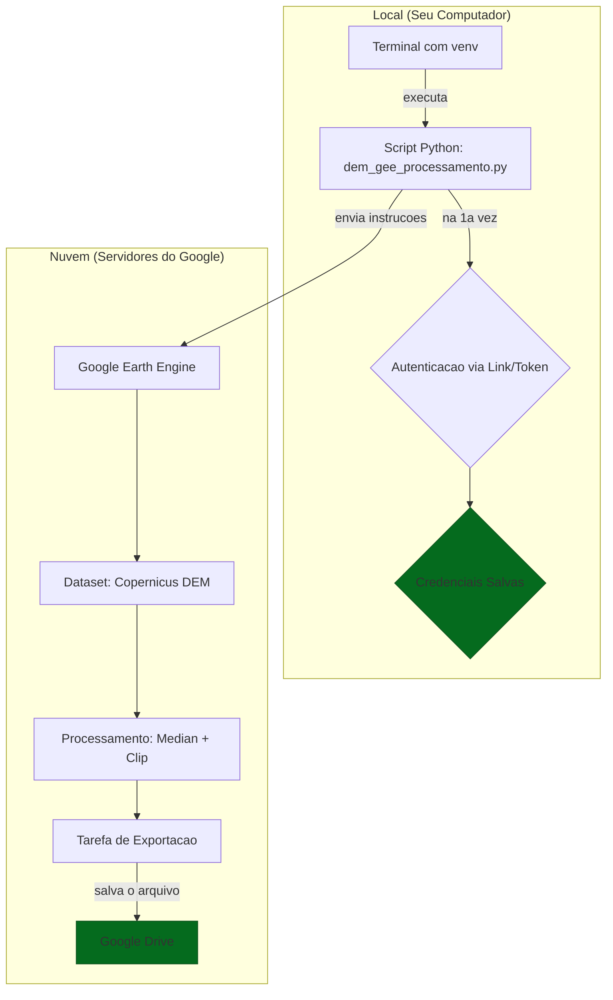

---

# Tutorial Definitivo: Gerando um DEM com Google Earth Engine (Python) via Terminal

Este tutorial descreve o fluxo de trabalho completo para processar e exportar um Modelo Digital de Elevação (DEM) para uma área extensa, utilizando o poder da nuvem do Google Earth Engine (GEE) através de um script Python executado localmente.

Esta abordagem é a mais eficiente, pois **evita o download de grandes volumes de dados**, delegando todo o processamento pesado aos servidores do Google.

## Objetivo

Gerar um único arquivo GeoTIFF contendo o DEM do Copernicus 30m para uma área definida (neste caso, o estado de São Paulo) e salvá-lo diretamente no Google Drive.

## Etapa 0: Pré-requisitos

1.  **Python e Ambiente Virtual (`venv`):** Um ambiente Python isolado para instalar as bibliotecas [Veja qui como instalar](https://github.com/maviz991/tutorial/blob/main/tutorial_install_py_linux.md).
2.  **Conta no Google Earth Engine:** É necessário ter o acesso aprovado. [Solicite aqui, se necessário](https://signup.earthengine.google.com/).
3.  **Biblioteca `earthengine-api`:** A API oficial do Google para interagir com o GEE.
Dentro do seu ambiente venv ativado
  ```bash
  pip install earthengine-api
  ```
E instale:
  ```bash
  pip install gcloud
  ```

## Etapa 1: O Script de Processamento (com Autenticação Integrada)

Diferente de outros métodos, a abordagem mais robusta para um ambiente de terminal é integrar a autenticação diretamente no script. Ele tentará se conectar e, se for a primeira vez, guiará você pelo processo de autenticação.

Use o código de [`dem_gee_processamento.py`](dem_gee_processamento.py).


## Etapa 2: Execução e Monitoramento

1.  **Execute o script** no seu terminal (com o `venv` ativado):
    ```bash
    python dem_gee_processamento.py
    ```
2.  **Autenticação (somente na primeira vez):**
    *   O script imprimirá "Primeira autenticação necessária..." e fornecerá um **link**.
    *   Copie o link e cole em um navegador.
    *   Faça login com sua conta Google e permita o acesso.
    *   O Google fornecerá um **código de autorização**. Copie-o.
    *   Cole o código de volta no seu terminal e pressione `Enter`.

3.  **Acompanhe a Saída:** O script irá então se conectar, montar as instruções e iniciar a tarefa. Ao final, ele imprimirá o status e o link para monitoramento. O script local será encerrado, o que é o comportamento esperado.

4.  **Monitore na Web:**
    *   Acesse o link: [https://code.earthengine.google.com/tasks](https://code.earthengine.google.com/tasks)
    *   Você verá sua tarefa (`DEM_Sao_Paulo_Copernicus_GLO30`) na lista.
    *   Quando a tarefa for concluída (marcada com um `✓` verde), o arquivo `.tif` estará na pasta `GEE_Exports` do seu Google Drive.

## Resumo Esquemático do Fluxo de Trabalho


