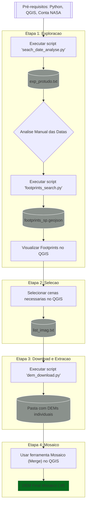

---

# Tutorial: Criando um Mosaico DEM de Larga Escala com ALOS PALSAR e Python via asf_search


Este tutorial descreve o fluxo de trabalho completo para buscar, baixar e preparar dados de Modelos Digitais de Elevação (DEM) derivados de imagens de satélite ALOS PALSAR, com o objetivo de criar um mosaico para uma área extensa, como o estado de São Paulo.

## Etapa 0: Pré-requisitos

Antes de começar, garanta que você tenha:

1.  **Python 3.x** instalado.
2.  A biblioteca `asf_search` instalada [Github do projeto](https://github.com/asfadmin/Discovery-asf_search).
   
    ```bash
    pip install asf_search
    ```
    
4.  Uma conta no **NASA Earthdata Login** (essencial para o download). [Crie sua conta aqui](https://urs.earthdata.nasa.gov/users/new).
5.  Um software SIG para visualização, como o **QGIS** (gratuito e de código aberto).

## Etapa 1: Exploração (O Que Existe?)

Não podemos baixar dados às cegas. Primeiro, precisamos descobrir quais imagens estão disponíveis e onde elas estão localizadas. Para isso, geramos um arquivo geográfico (`.geojson`) com os contornos (footprints) de todas as cenas disponíveis para nossa área de interesse  `wkt_sp_retangulo`.
Mas para isso devemos nos guiar a partir de uma análise empirica das datas, através de [`seach_date_analyse.py`](search_date_analyse.py), para filtramos as datas que vamos trabalhar a seguir.


#### 1.2 - Script de filtro temporal

O script [`seach_date_analyse.py`](search_date_analyse.py) explora e os produtos disponíveis através de em uma lista de imagens disponíveis com: Nome (`fileID`), Data de aquisição (imageamento) e Direção da órbita.
Ele imprime no terminal a lista, para uma analise melhor gere um txt, executando dessa forma:

```bash
python seach_date_analyse.py > exp_protudo.txt
```

Então, a partir dessa análise você pode definir o espaço temporal de geração dos footprints de forma mais eficáz.

#### 1.3 - Script de Geração de Footprints

O script [`footprints_search.py`](footprints_search.py) busca todos os produtos ALOS PALSAR RTC sobre uma área `wkt_sp_retangulo` e salva seus footprints em um arquivo **`footprints_sp.geojson`**.


#### 1.4 - Visualização no QGIS

1.  Abra o QGIS.
2.  Carregue um shapefile ou GeoJSON com o limite do seu estado/área.
3.  Arraste e solte o arquivo `footprints_sp.geojson` gerado no painel de camadas.
4.  Você verá todos os contornos das imagens sobrepostos ao mapa, permitindo uma análise visual da cobertura.

## Etapa 2: Seleção (Escolhendo as Imagens Corretas)

Nosso objetivo é selecionar o **menor número de imagens** que garantam **cobertura total**, preferencialmente de datas próximas e da mesma órbita para maior consistência.

1.  **Identifique as "Faixas":** No QGIS, você notará que as imagens de uma mesma data formam uma "faixa" contínua.
2.  **Selecione as Cenas:** Use a ferramenta de seleção do QGIS para selecionar interativamente as faixas e cenas individuais necessárias para "pintar" toda a sua área de interesse, sem deixar buracos.
3.  **Exporte a Lista de Nomes:**
    *   Com as cenas necessárias selecionadas, clique com o botão direito na camada de footprints e abra a **Tabela de Atributos**.
    *   Filtre para mostrar apenas as feições selecionadas.
    *   Selecione e copie a coluna com os nomes das cenas (geralmente `fileID`) - poderá gerar um CSV → TXT (UTF-8).
    *   Cole esta lista em um novo arquivo de texto chamado `list_imag.txt` em `UTF-8`, com um nome de cena por linha.

## Etapa 3: Download e Extração Otimizados

Para evitar o download de Terabytes de dados desnecessários, usamos um script que baixa um arquivo por vez, extrai **apenas o DEM**, e deleta o arquivo compactado para liberar espaço.

Ele baixa as cenas através de uma lista txt gerada a partir dos footprints selecionados, que recobrem a área de interesse.

O script [dem_download.py]([dem_download.py) é robusto e lida com diferentes convenções de nomes de arquivos (`_dem.tif` vs `.dem.tif`) e com a estrutura de pastas dentro dos arquivos `.zip`.


## Etapa 4: Mosaico (Juntando as Peças)

Com a pasta `dems_finais_sp` cheia de arquivos `.tif`, o passo final é uni-los em um único raster.

1.  Abra o QGIS.
2.  Vá no menu **Raster -> Miscelânea -> Mosaico (Merge)**.
3.  Na janela que abrir, clique no botão `...` ao lado de "Camadas de entrada".
4.  Clique em "Adicionar Arquivos" e selecione **todos** os arquivos `.tif` da sua pasta `dems_finais_sp`.
5.  Em "Mosaico", escolha um local e nome para salvar o seu DEM final (ex: `DEM_SP_12.5m.tif`).
6.  Execute o processo. Ao final, você terá um único arquivo com o DEM completo da sua área.

---

## Conceitos-Chave e Lições Aprendidas

*   **Footprint vs. Imagem Corrigida:** O footprint (inclinado) representa a geometria da captura do satélite. O DEM (retangular, alinhado ao norte) é o produto final após a correção geométrica (ortorretificação). O desalinhamento entre eles é normal e esperado.
*   **Resolução do DEM:** Os arquivos DEM nos produtos ALOS PALSAR RTC de 12.5m são derivados de fontes de ~30m (como o Copernicus DEM). Eles são **reamostrados** para 12.5m para corresponder à grade da imagem de radar, mas a resolução efetiva da informação de relevo é de 30m.
*   **Robustez do Código:** Ao lidar com grandes arquivos de dados, é crucial escrever código que antecipe problemas, como arquivos ausentes, inconsistências nos nomes (`_dem.tif` vs `.dem.tif`) e estruturas de pastas inesperadas.

---

### Fluxo de Trabalho: Mosaico DEM com `asf_search`


